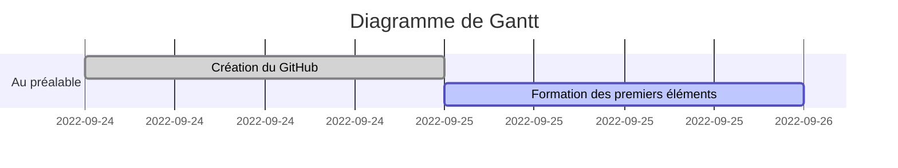

# CluedoBayesien
Cluedo et Mathématiques Bayésiennes

## Objectifs [Susceptibles de changer dans un premier temps]
- Construction d'un modèle jouet
  - Restriction du Cluedo à un modèle plus simple
  - Formules de combinatoire
- Sur le Bayésianisme
  - Introduction au Bayésianisme
  - La formule de Bayes
- Le choix d'une stratégie : vers la théorie des jeux
  - Formalisme d'une stratégie
  - Vers une statégie mixte
- Vers une simulation
  - Choix mixte / honnête / bluff
  - Définition d'un objectif **précis**
    - Maximiser le nombre de victoires ?
    - Minimiser le nombre d'hypothèses ? 

## Chronologie

## MindMap
Idées actuellement à l'étude : 

