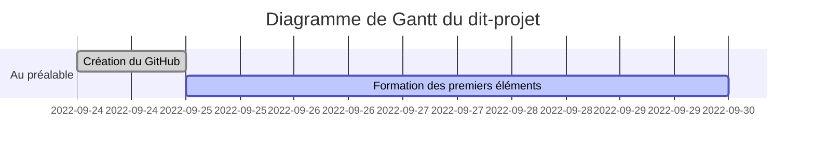

# CluedoBayesien
Cluedo et Mathématiques Bayésiennes

## Chronologie

## MindMap
Idées actuellement à l'étude : 

## Objectifs
- Mathématiques
  - Probabilités
    - Théorie bayésienne
    - Jeu Bayésien
  - Théorie des jeux
    - Stratégie Mixte
    - Jeu Bayésien
- Informatique
  - Simulation d'un modèle jouet
  - Création de visuels
- Vulgarisation
  - Choix et création de visuels
  - Communication visuelle
- Soft Skills
  - Communication
  - Gestion de projet
