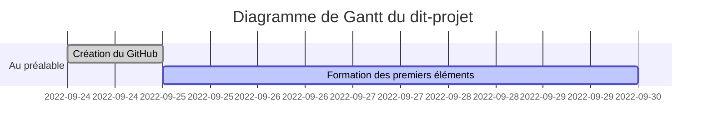

# CluedoBayesien
Cluedo et Mathématiques Bayésiennes

## Chronologie et idées en vrac

 

## Objectifs à court terme
- Commencer une veille documentaire
- Lister les publications à ce sujet
  - 
  - Zotero
- Mettre à jour les objectifs à long terme, et fixer **une fois pour toutes** les limites du projet

## Objectifs à long terme
- Mathématiques
  - Probabilités
    - Théorie bayésienne
    - Jeu Bayésien
  - Théorie des jeux
    - Stratégie Mixte
    - Jeu Bayésien
- Informatique
  - Simulation d'un modèle jouet
  - Création de visuels
- Vulgarisation
  - Choix et création de visuels
  - Communication visuelle
- Soft Skills
  - Communication
  - Gestion de projet
